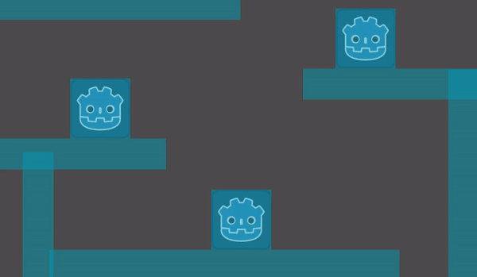
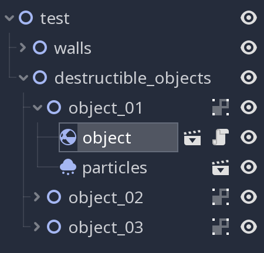

# Godot 3 2D Destructible Objects

A script that takes a sprite, divides it into blocks and makes them explode 💥!



## Limitations

Right now, the sprites must be square for this script to work properly.

## Prerequisites

Each destructible object must follow this structure and must be its own `Scene` file.

```
RigidBody2D
├── Sprite
└── CollisionShape2D
    └── RectangleShape2D
```
 
## Usage

* Create a `Node2D` that will contain all the destructibles objects (e.g. `destructible_objects`).
* Add a `Node2D` as a child node of the prior `Node2D` (e.g. `object_01`).
* Instance the destructible object `Scene` file.
* Attach `explode_object.gd` to the destructible object as a `Script`.



The reason for organizing it this way is because then you can add particles (`Partcicles2D` or `CPUParticles2D`) or hitboxes (`Area2D`) or whatever you feel like to the `Node2D` (e.g. `object_01`) holding the main `RigidBody2D`.

## Parameters

### Blocks Per Side

| Name | Type | Description |
| --- | --- | --- |
| `blocks_per_side` | `int` | The blocks per side. Minium `2`. Maximum `10`. |

 **Example**: `4` block per side makes a total of `16` blocks.

### Blocks Impulse

| Name | Type | Description |
| --- | --- | --- |
| `blocks_impulse` | `float` | The "force" of the blocks when they explode. |

### Blocks Gravity Scale

| Name | Type | Description |
| --- | --- | --- |
| `blocks_gravity_scale` | `float` | The gravity of the blocks. |

### Debris max time

| Name | Type | Description |
| --- | --- | --- |
| `debris_max_time` | `float` | The seconds it will pass until the blocks become `STATIC`. |

### Collision layers

| Name | Type | Description |
| --- | --- | --- |
| `collision_layers` | `int` | The collision layers of the blocks. |

Sum all the values of the layers.

**Example**: `Layer 1` value is `1`. `Layer 5` value is `16`. So `collision_layers` would be `17`.

### Collision masks

| Name | Type | Description |
| --- | --- | --- |
| `collision_masks` | `int` |  The collision masks of the blocks. |

Sum all the values of the layers.

**Example**: `Layer 1` value is `1`. `Layer 5` value is `16`. So `collision_layers` would be `17`.

### Debug mode

| Name | Type | Description |
| --- | --- | --- |
| `debug_mode` | `bool` |  Prints some debug data. |


## Changelog

See [CHANGELOG](CHANGELOG.md).

## Authors

* Me 😛 [hiulit](https://github.com/hiulit).

## Credits

Thanks to:

* Airvikar - For this [Youtube video](https://www.youtube.com/watch?v=ExX7Qyldtfg) that is the code base for this script.
* Securas - For all the [great games](https://securas.itch.io/) and [Twitch streams](https://www.twitch.tv/sec_ras/videos?filter=all&sort=time) that give me lots of ideas, and particularly, the destructible objects one.
* [Scott Lembcke](https://twitter.com/slembcke) - For letting me know about Voronoi regions and helping me with adding more depth to the explosion (random collisions and z-index).


## License

[MIT License](LICENSE).